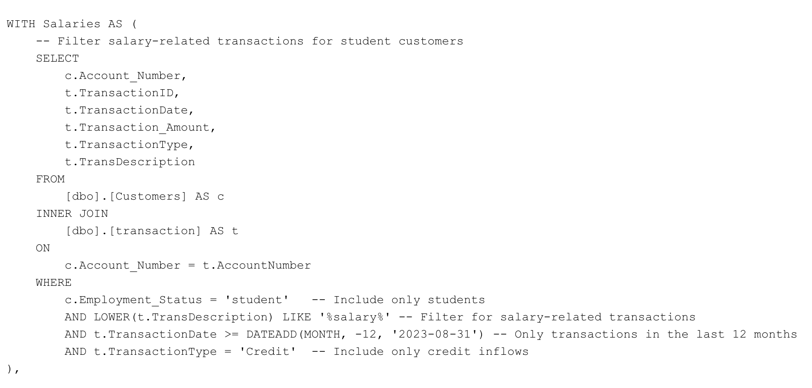
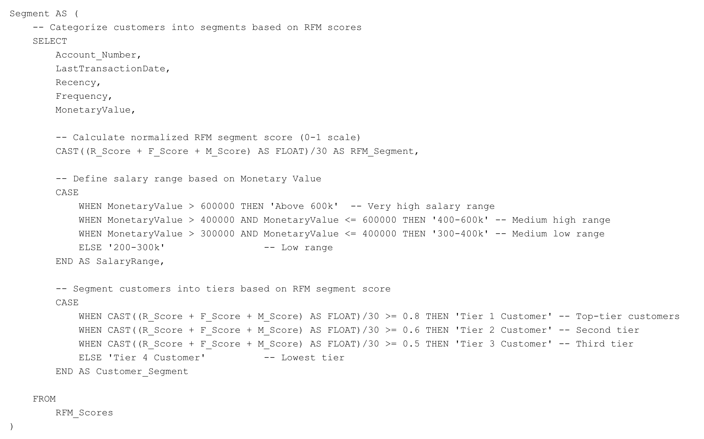

# Customer Analytics: Leveraging SQL and Power BI to Identify Former Student Customers for Targeted Service Offerings and Upselling Opportunities

## Table of Contents

- [Business Introduction](#business-introduction)
- [Business Problem](#business-problem)
- [Rationale for the Project](#rationale-for-the-project)
- [Aim of the Project](#aim-of-the-project)
- [Data Description](#data-description)
- [Tech Stack](#tech-stack)
- [Project Scope](#project-scope)
- [Sample Queries](#sample-queries)
- [Insights and Recommendations](#insights-and-recommendations)

## Business Introduction
NovaTrust Bank is a full-service financial institution offering banking solutions to individuals and businesses. The bank provides core products like checking and savings accounts, loans, credit and debit cards, and investment services, with a strong focus on digital banking through advanced online and mobile platforms.

Committed to customer satisfaction, NovaTrust offers 24/7 support while leveraging digital solutions to enhance user experience and streamline operations. 

## Business Problem
NovaTrust Bank aims to address a critical opportunity within its student customer segment as follows:
- Target Segment: Many customers who opened student accounts during college continue to use these accounts post-graduation, even after joining the workforce.
- Missed Opportunities: These customers often remain unaware of NovaTrust’s specialized products and services tailored for working professionals.
- Strategic Goal: The bank seeks to identify former student account holders who:
  - are now employed and receiving regular salary deposits.
  - have seen at least 10 salary deposits in the past year.
  - earn average monthly salaries exceeding 200,000.

By focusing on this segment, NovaTrust aims to offer curated service offerings such as tailored loan opportunities and account upgrades, ensuring these customers receive solutions aligned with their evolving financial needs.

## Rationale for the Project
Recognizing the lifetime value of its customers, NovaTrust Bank understands that upselling and cross-selling to existing customers is significantly more cost-effective than acquiring new ones. With an established trust and banking history, these relationships provide a strong foundation for enhancing financial experiences.

By identifying former student account holders who have transitioned into the workforce, the bank can leverage data to craft targeted campaigns. These efforts will introduce customers to services that match their current financial needs, such as home loans, tailored investment advisories, and other advanced financial solutions. This approach not only strengthens customer loyalty but also maximizes the value derived from long-term relationships.

## Aim of the Project
The primary goal of this project is to identify and segment NovaTrust Bank's former student customers who are transitioning into the workforce and are likely to benefit from the bank’s tailored products and services for working professionals. This will enable the creation of targeted marketing campaigns to introduce these customers to offerings such as credit cards, personal loans, and investment accounts.

Tasks for the Analyst
- Identify all accounts opened as student accounts with consistent salary inflows over the past year.
- Segment these customers into categories based on salary amount and frequency of salary deposits within the last year.
- Provide actionable insights to NovaTrust Bank’s marketing team to design targeted campaigns for engaging these customer segments effectively.

## Data Description
The data for this project comprises of 2  tables;

- Customer Table

  - CustomerID: Unique identifier for each customer.
  - FirstName: First name of the customer.
  - LastName: Last name of the customer.
  - DateOfBirth: Date of birth of the customer.
  - Contact_Email: Email address.
  - Phone: Phone number.
  - Account_Type: Type of account (e.g, savings, current).
  - Account_Open_Date: Date when the account was opened.
  - Account Number (PK): Unique customer account number.
  - Employment Status: Employment status as at when account was opened.

- Transactions Table

  - TransactionID (PK): Unique identifier for each transaction.
  - Account Number(FK): Refers to the account number in the Customers table.
  - Transaction_Date: Date of the transaction.
  - Transaction_Type: Type of transaction (credit or debit).
  - Transaction_Amount: Amount involved in the transaction.
  - TransDescription: Description or label of the transaction.

## Tech Stack
Microsoft SQL Server
- Utilized for creating a simple database from the Customer and Transactions tables.
- Data cleaning, exploratory analysis, and data manupilation.
- Data Augmentation and Segementation, using an RFM (Recency, Frequency, Monetary Value) Model to segment the student customers.
- Stored Preocedure, to ensure script reusability and enhance automation.

Microsoft Power Bi
- DAX for creating simple, custom calculations within Power Bi to enrich analysis.
- Create simple, interactive visualizations to present to the Marketing team, per the business requirements.

## Project Scope
1. Data Exploration
   - Explore the data to understand its characteristics and discover patterns.
  
2. Data Extraction
   - Develop the queries needed to manipulate & extract the required data, per the business requirements from the marketing team.
  
3. RFM Scoring
   - Compute RFM scores based on the recency, frequency, and monetary transaction value for each student customer.

4. Customer Segmentation
   - Decide on segmentation criteria and use the RFM scores to segment customers into groups.
  
5. Salary Breakdown
   - Group the student customers into various salary brackets, based on the average salaries they have recieved during the period in consideration.

6. Reporting and Documentation
   - Export the segmented dataset and document the methodologies employed in the project.

7. Data Visualization
   - Create a user-friendly dashboard from the segmented dataset, to tell a story and clearly communicate insights to the marketing team.

8. Recommendations
   - Present clear, actionable insights to the marketing team based on analysis.
  
## Sample Queries

An extract from the EDA, involving checking for missing and duplicate records is below;

**Common Table Expressions (CTEs)** were used in the customer segmentation script to enhance readability and simplify the queries.

The full EDA script can be found [here](NovaTrust_EDA.sql)

Below is the section of the script, where I filtered for student customers, per the business requirement.

Next, I calculated the RFM values for each student customer. This further filters the result to students earning at least 200k per month and have received at least 10 salary payments in the last 12 months.

After this, scores are assigned to the student customers based on their RFM Scores.

Here is where the customer segmentation takes place. We group the customers into different salary ranges and segment them into different Tiers, based on their normalized RFM scores.

Finally, the segmented data is retrieved, together with related cutomer information like email to send to the marketing team. This contains 204 records of the most valuable student customers that the marketing team should focus on for targeted offerings and upselling opportunities.

The full segmentation script, which includes the use of **Stored Procedure** to enhance reusability can be found [here](NovaTrust_204.sql)

## Insights and Recommendations
An overview of the dashboard can be found below:

You can view and interact with the report [here](https://app.powerbi.com/view?r=eyJrIjoiOGJlNzNiZjktZTJjNS00OTNlLTgxMzgtYWYxYWM3YzAwZTA3IiwidCI6IjBjODQwNDRjLTRmZDUtNGU4My1iYjczLWNiYjhjNjI3OGIyZiJ9)

## Recommended Strategies for Engagement

1. **Prioritize Tier 2 Customers in the 300-400k Salary Range**

   - Tier 2 customers in the 300-400k range make up the largest and most valuable customer base (55%), with 113 customers. They represent medium-high engagement and income, offering a balanced mix of loyalty and potential for further growth.

   **Recommendation**
   - Promote Flexible Loan Products (e.g., personal or education loans) with attractive rates to tap into their financial aspirations, such as professional development or lifestyle upgrades. Use personalized communication to           highlight how        the bank can support their medium-term goals.

2. **Upsell Investment Products to Tier 1 Customers in the 400-600k Salary Range**
   
   - Tier 1 customers in the 400-600k range are the most affluent and engaged (60 customers, top RFM scores). They likely have surplus income and a higher propensity to invest in premium products.

   **Recommendation**
   - Offer structured investment options, such as mutual funds, tax-saving bonds, or portfolio management services, combined with financial advisory sessions to help these customers grow their wealth while deepening their relationship with the bank.
  
3. **Focus on Financial Literacy and Savings for Tier 3 Customers in the 200-300k Salary Range**

   - Tier 3 customers in the 200-300k range are the least engaged and financially constrained. They may lack awareness of banking products and are at risk of becoming inactive.

   **Recommendation**
   - Provide financial literacy programs focusing on basic budgeting and savings habits. Pair this with low-barrier savings accounts or micro-investment opportunities to help them build financial stability and trust with the bank.

